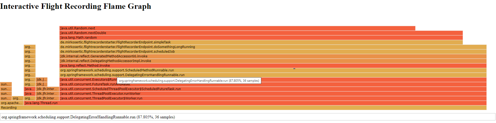

# Why & When

 [](https://maven-badges.herokuapp.com/maven-central/de.mirkosertic/flight-recorder-starter)

This is a Spring Boot 2 Starter exposing the JDK Flight Recorder as a Spring Boot Actuator Endpoint.

Normally the JDK Flight Recorder is available locally or by JMX remote. Depending on your deployment scenario shell or
JMX access might not be available for the application server. Here comes this handy starter into play!

# How

This starter adds a new Spring Boot Actuator endpoint for JDK Flight Recorder remote control. This RESTful endpoint
allows starting and stopping Flight Recording and downloading the `.jfr` files for further analysis.

Just add the following dependency to your Spring Boot 2 project:

```xml

<dependency>
    <groupId>de.mirkosertic</groupId>
    <artifactId>flight-recorder-starter</artifactId>
    <version>2.2.1</version>
</dependency>
```

and don't forget to add the following configuration:

```yml
flightrecorder:
  enabled: true  # is this starter active?
``` 

IMPORTANT: By default, this starter doesn't include spring webmvc or spring webflux dependencies. You will have to
include them according the stack you wish.

**WebMvc**

```xml

<dependency>
    <groupId>org.springframework.boot</groupId>
    <artifactId>spring-boot-starter-web</artifactId>
</dependency>
```

**WebFlux**

```xml

<dependency>
    <groupId>org.springframework.boot</groupId>
    <artifactId>spring-boot-starter-webflux</artifactId>
</dependency>
```

Please note: the minimum Java/JVM runtime version is 11!

## Starting Flight Recording

The following `cURL` command starts a new Flight Recording and returns the created Flight Recording ID:

``` shell
curl  -i -X POST -H "Content-Type: application/json" -d '{"duration": "60","timeUnit":"SECONDS"}' http://localhost:8080/actuator/flightrecorder/

HTTP/1.1 201 
Location: http://localhost:8080/actuator/flightrecorder/1
Content-Length: 0
Date: Fri, 05 Feb 2021 12:37:07 GMT

```

Flight Recording starts for a given period, in this case 60 seconds and stops then.

Every recording session gets its own unique Flight Recording ID. The endpoint returns this ID as plain text, in this
case ID `1`. This ID must be used to download the recorded data.

### Advanced commands

In order to cover more recording options, the payload sent can be composed by different params. Following the whole list
of params:

| Field Key | Value Type | Mandatory | Description |
| ------------- |-------------| :-----: | --------|
| description | String | NO | The description for the recording |
| duration |  Number | YES  | The duration of recording  |
| timeUnit |  Serialized ChronoUnit value | YES  | The unit for duration param  |
| maxAgeDuration  | Number  | NO  | The max age of data you can preserve  |
| maxAgeUnit  | Serialized ChronoUnit value  | NO  | The unit for maxAge param  |
| delayDuration  | Number  | NO  | Schedule the recording  |
| delayUnit  |  Serialized ChronoUnit value | NO  | The unit for delay param  |
| maxSize | Number  | NO  | Max size of file (in bytes)  |
| customSettings | JSON Object with N fields  | NO  | JSON object with custom properties that will override the properties in the base configuration  |

More info at JFR Javadoc [here](https://docs.oracle.com/en/java/javase/11/docs/api/jdk.jfr/jdk/jfr/Recording.html).

Example of JSON param:

```json
{
  "description": "MyFirstRecording",
  "duration": "60",
  "timeUnit": "SECONDS",
  "maxAgeDuration": "10",
  "maxAgeUnit": "SECONDS",
  "delayDuration": "5",
  "delayUnit": "SECONDS",
  "maxSize": "100000",
  "customSettings": {
    "myCustomProperty1": "myCustomValue1",
    "myCustomProperty2": "myCustomValue2"
  }
}
```

## Downloading results

The following `cURL` command stops the Flight Recording with ID `1` and downloads the `.jfr` file:

```shell
curl --output recording.jfr http://localhost:8080/actuator/flightrecorder/1
```

The downloaded `.jfr` file can be imported into JDK Mission Control (JMC) for further analysis.

## Visiting the interactive Flamegraph

This starter can generate an interactive Flamegraph from a Flight Recorder recording. You can gain a quick overview by
visiting the following URL in your browser to see the graph for a recording with ID `1`:

```
http://localhost:8080/actuator/flightrecorder/ui/1/flamegraph.html
```

and you'll get:



The starter automatically tries to visualize only classes belonging to the running Spring Boot application. It filters
the stacktrace samples by classes that are in the package or sub-package of the running application instance annotated
with a
`@SpringBootApplication` annotation.

However, you can always get the unfiltered Flamegraph by visiting:

```
http://localhost:8080/actuator/flightrecorder/ui/1/rawflamegraph.html
```

## Stopping Flight Recording

The following `cURL` command stops the Flight Recording with ID `1`.

```shell
curl -i -X PUT http://localhost:8080/actuator/flightrecorder/1


HTTP/1.1 200
Content-Type: application/json
Transfer-Encoding: chunked
Date: Fri, 05 Feb 2021 12:39:43 GMT

{"id":1,"startedAt":"2021-02-05 13:37:08","status":"CLOSED","finishedAt":"2021-02-05 13:39:43","description":null}

```

## Delete Flight Recording

The following `cURL` command stops the Flight Recording with ID `1`.

```shell
curl -i -X DELETE http://localhost:8080/actuator/flightrecorder/1

HTTP/1.1 204 
Date: Fri, 05 Feb 2021 12:40:13 GMT

```

Later, this recording might be deleted in memory and physically by the scheduler process described below.

### Auto-deletion process

IMPORTANT: Be aware that the main app should be annotated with @EnableScheduling to enable the scheduled processes for auto-deletion.

The process periodically deletes recording files, which are in status `STOPPED` or `CLOSED`. The cleanup interval can be configured via

```properties
flightrecorder.recording-cleanup-interval=5000
```

with default value set on 5000ms. The base unit is MILLISECONDS. Take into account that the deletion is permanently.

The watermark used to annotate a recording as "removable" is either time-based (TTL) or count-based (COUNT).

The default cleanup type is `TTL` and can be changed using the property:
```properties
flightrecorder.recording-cleanup-type=COUNT
```

#### Deletion by TTL

If the cleanup type is `TTL` (time to live), the recording's start time represents the reference point for the TTL deletion. The threshold can be configured via the properties below (default: 1 Hour):

```properties
flightrecorder.old-recordings-TTL=1
flightrecorder.old-recordings-TTL-time-unit=Hours  # java.time.temporal.ChronoUnit available values
```

A file will be removed when the status is `STOPPED` or `CLOSED`, and the recording's start time is before _now_ minus _threshold configured_.

#### Deletion by COUNT

If the cleanup type is `COUNT`, the oldest recordings will be deleted when the total number of existing recordings surpasses the configured threshold of recordings to keep. The threshold can be configured via the property below (default: 10 recordings):

```properties
flightrecorder.old-recordings-max=10
```

A file will be removed when the status is `STOPPED` or `CLOSED`, based on a FIFO logic.


## Trigger Flight Recording based on Micrometer Metrics

This starter allows automatic Flight Recording based on Micrometer Metrics. Using an application configuration file we
can configure triggers based on SpEL (Spring Expression Language) which are evaluated on a regular basis. Once a trigger
expression evaluates to true, a Flight Recording in started with a predefined duration and configuration. The most
common setup would be to trigger a Flight Recording profiling once CPU usage is above a given value.

By default, this feature is enabled. In case you want to disable it, set the following property to `false`:

```properties
flightrecorder.trigger-enabled=false
```

This scheduled process is executed each 10 seconds. The default configuration can be changed thought this property:

```properties
flightrecorder.trigger-check-interval=10000
```

By default, this scheduled process is executed each 10 seconds. The default configuration can be changed thought this
property:

```properties
flightrecorder.trigger-check-interval=10000
```

IMPORTANT: Be aware that the main app should be annotated with @EnableScheduling to enable the scheduled processes.

Here is a sample configuration file in YAML syntax:

```yml
flightrecorder:
  enabled: true  # is this starter active?
  recording-cleanup-interval: 5000 # try to cleanup old recordings every 5 seconds
  trigger-check-interval: 10000 # evaluate trigger expressions every 10 seconds
  trigger:
    - expression: meter('jvm.memory.used').tag('area','nonheap').tag('id','Metaspace').measurement('value') > 100
      startRecordingCommand:
        duration: 60
        timeUnit: SECONDS
``` 

The list of all created recordings can be seen as a JSON file using the following api:

```
http://localhost:8080/actuator/flightrecorder/
```

## Advanced Configuration

### Location of recordings

By default, all the recording files are stored at temporal system folder, ofter the "/tmp" folder. This base path can be
changed through the following property:

```yml
flightrecorder:
  jfr-base-path: /my-path 
```

### Custom configuration profile for recordings

By default, the used configuration is "_<<JAVA_HOME>>/lib/jfr/profile.jfc_". A custom configuration can be changed
through the following property:

```yml
flightrecorder:
  jfr-custom-config: mycustomjfc 
```

**NOTE**: Just only the file's name (without extension) is required, not whole path.
